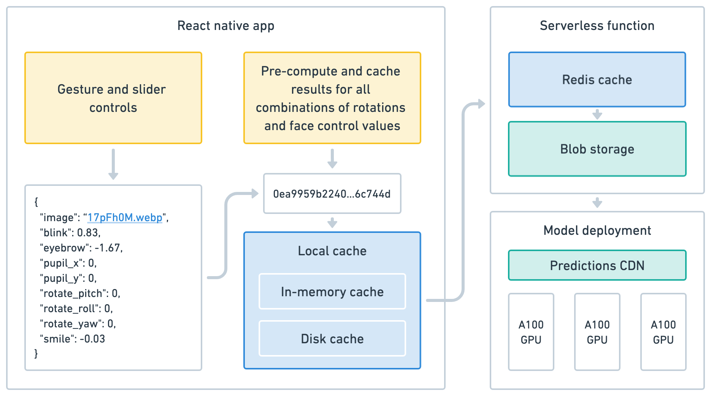

# Expression Editor

Expression Editor is a React Native app that reimagines photo editing by allowing users to change the expression of a photo after capture. Built to seamlessly integrate with iOS 18's design language, it combines on-device and cloud image models to enable natural manipulation of facial features. The app is powered by the [LivePortrait](https://liveportrait.github.io/) model (via [Replicate](https://replicate.com/)), while maintaining the familiar Photos app experience through thoughtful UI and haptic feedback. Custom Skia shaders provide smooth loading animations that enhance the user experience during model inference. I built this app to explore how my own photo-taking behavior would change in a world where expressions could be adjusted after the fact.

<video src="https://github.com/user-attachments/assets/4f258f99-3fa5-4506-a563-b2ebd1a554bb"></video>

## Motivation

This project represents both a technical and design exploration. It serves as a comprehensive investigation into:

1. **Hybrid model deployment**: The app demonstrates how to effectively combine on-device ML models with cloud-based models to create a seamless UX. This hybrid approach balances immediate responsiveness with powerful image editing capabilities.

2. **Reducing capture anxiety**: The project explores how expression editing can reduce the pressure of capturing the perfect moment. Traditional photography often creates anxiety around timing - the need to catch the exact right smile or expression. By enabling natural, gesture-based manipulation of facial expressions after capture, this project aims to shift focus from technical perfection to being present in the moment. Users can simply take the photo and adjust expressions later through intuitive direct interaction, making the entire picture taking experience more relaxed and meaningful.


3. **Extending iOS design language**: The app serves as a case study in extending and applying the iOS 18 design language to new interaction patterns. It carefully adopts familiar UI components and animations from the Photos app while thoughtfully expanding them to support novel features:
  - Maintains consistency with system gestures and transitions
  - Preserves familiar navigation patterns and UI components such as sliders, carousels, and image editing controls
  - Extends existing UI components to support new functionality
  - Implements haptic feedback patterns that match system behaviors


## Project Structure

The project is organized as a monorepo using [Turborepo](https://turbo.build/). It consists of the following apps:

- **`apps/expo`**: The main React Native app built with Expo.
  - Handles user interface and interactions
  - Implements gesture controls for facial expression editing
  - Manages local caching of results
  - Implements a Photos app-like UI with carousels and grid views

- **`apps/web`**: An API server built with Next.js.
  - Provides API endpoints for inference requests to the Replicate model
  - Handles server-side caching using Vercel KV and Blob Storage
  - Manages photo uploads and storage

## Key Features

### Gesture Controls

- Direct manipulation of facial features using intuitive gestures
- Real-time preview of expression changes
- Precise control over facial features via sliders with haptic feedback
- Support for:
  - Face rotation (pitch, yaw, roll)
  - Eye position and blinking
  - Smile intensity
  - Eyebrow position

### Shader loading animation

While the app preemptively generates and caches common facial expressions for immediate access, users may occasionally request uncached variations. In these cases, the app leverages an on-device selfie segmentation model to display a nice loading state. The model isolates the subject from the background, allowing the app to apply animated shader effects specifically to the person in the image. This creates a pleasant loading experience that clearly communicates that the app understands the image and is working on generating a new expression.

| Segmentation | Shader animation | Final result |
|--------------|--------------|--------------|
|  | <video src="https://github.com/user-attachments/assets/09c4151b-25df-49e4-a0b0-27552310b30f"></video> | <video src="https://github.com/user-attachments/assets/82073f35-df9c-4b94-b3b9-239e327808c0"></video> |

1. **On-device segmentation models**: The app uses [Mediapipe's selfie segmentation model](https://github.com/google-ai-edge/mediapipe/blob/master/docs/solutions/selfie_segmentation.md) to identify and separate different parts of an image, such as the face, hair, and background. This segmentation data is then used to apply shaders selectively to different segments.

2. **Shaders**: A custom shader is applied to the segmented parts of the image. These shaders are written using [Skia's runtime effects](https://shopify.github.io/react-native-skia/docs/shaders/overview/). See [apps/expo/components/WaveShader.ts](apps/expo/components/WaveShader.ts) for implementation details.

3. **Animation**: The shaders are animated using [React Native Reanimated](https://docs.swmansion.com/react-native-reanimated/), which allows for smooth and performant animations without blocking the UI thread. The animation parameters, such as time and position, are dynamically updated to create a looping effect.

### Multi-level Caching Strategy

The app uses a sophisticated multi-level caching strategy combined with proactive processing to provide a low-latency responsive experience. When a user uploads a new photo, the app immediately begins processing a predefined set of common expression variations in the background. Rather than allowing infinite combinations of parameters, the app quantizes input values (e.g. rotation angles are limited to 15° increments) to maximize cache hits while still allowing enough flexibility to generate a wide range of expressions. This means that most user interactions will hit a pre-warmed cache:



- **In-memory caching**: Generated expressions are temporarily stored in memory using a dedicated cache object for instant retrieval. The app leverages view transitions to proactively populate this cache with images that may be needed soon.
- **Local storage caching**: Results are cached locally using [`AsyncStorage`](https://docs.expo.dev/versions/latest/sdk/async-storage/). If found, the result is stored in the in-memory cache for faster subsequent access. Provides offline access to previously generated expressions.
- **Server-side Caching**: Vercel Blob Storage and Vercel KV (Redis) are used for server-side caching. The server generates a cache key based on input parameters. It checks Redis and blob storage for cached results. If not found, the model is run, and the result is cached in Redis and Blob Storage for future requests.

### Photo Management

- Browse and select photos from a gallery
- Upload new photos
- Grid view for photo library
- Photo detail view

## Getting Started

### Prerequisites

Before running the app, ensure you have the following installed:

- Node.js (v14 or later)
- Yarn package manager
- Expo CLI

You will also need:
- Replicate API token (for model inference)
- Vercel account (for API server deployment)

### Environment Setup

1. Create a `.env` file in `apps/web`:
   ```plaintext
   BLOB_READ_WRITE_TOKEN=
   KV_REST_API_TOKEN=
   KV_REST_API_URL=
   REPLICATE_API_TOKEN=
   ```

2. Update the file in `apps/expo/api/constants.ts`:
   ```typescript
   export const BASE_URL = "https://your-app-name.vercel.app"; // or localhost if you are running locally
   ```

3. Deploy the [COG version](https://github.com/fofr/cog-expression-editor) of the [LivePortrait](https://liveportrait.github.io/) model on Replicate. Or you can use `https://replicate.com/fofr/expression-editor`, but it will be slower as it runs on L40S.

4. Update the model identifier in `apps/web/pages/api/replicate.ts`:
   ```typescript
   const MODEL_IDENTIFIER = "YOUR-REPLICATE-MODEL-IDENTIFIER";
   ```

### Installation

1. Clone the repository:
   ```bash
   git clone https://github.com/your-username/expression-editor.git
   cd expression-editor
   ```

2. Install the dependencies:
   ```bash
   yarn install
   ```

## Running the App

### Expo App

To run the Expo app:

1. Navigate to the `apps/expo` directory:
   ```bash
   cd apps/expo
   ```

2. Start the Expo development server:
   ```bash
   yarn start
   ```

3. Follow the instructions in the terminal to run the app on an iOS or Android simulator, or scan the QR code with the Expo Go app on your mobile device.

### API Server

To run the web app:

1. Navigate to the `apps/web` directory:
   ```bash
   cd apps/web
   ```

2. Start the Next.js development server:
   ```bash
   yarn dev
   ```

3. Update the endpoint in `apps/expo/api/constants.ts` to point to `http://localhost:3000`.

## Technologies Used

### Models
- COG (Custom Operator Graph) version of LivePortrait model by [fofr](https://github.com/fofr): https://github.com/fofr/cog-expression-editor
- [Mediapipe's selfie segmentation model](https://github.com/google-ai-edge/mediapipe/blob/master/docs/solutions/selfie_segmentation.md)

### Frontend
- React Native
- Expo
- [React Native Reanimated](https://docs.swmansion.com/react-native-reanimated/) - Animation library
- [React Native Gesture Handler](https://docs.swmansion.com/react-native-gesture-handler/) - Touch handling
- [React Native Skia](https://shopify.github.io/react-native-skia/) - Graphics and drawing
  - [React Native Skia shaders](https://shopify.github.io/react-native-skia/docs/shaders/overview/)

### Backend
- [Next.js](https://nextjs.org/)
- TypeScriptt
- Axios

### Infrastructure
- [Turborepo](https://turbo.build/) - Monorepo build system
- [Vercel KV](https://vercel.com/docs/storage/vercel-kv) (Redis) - Key-value storage
- [Vercel Blob Storage](https://vercel.com/docs/storage/vercel-blob) - File storage
- [Replicate](https://replicate.com/) - ML model hosting

## License
This project is licensed under the MIT License - see the [LICENSE](LICENSE) file for details.

